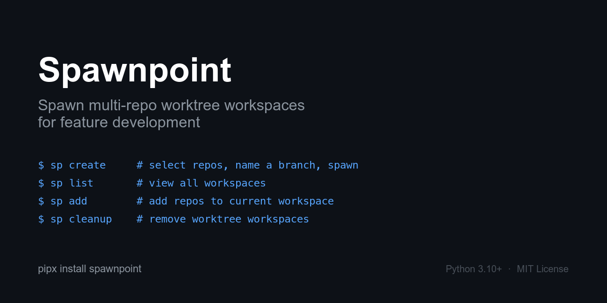

# Spawnpoint



Spawn multi-repo worktree workspaces for feature development.

Working on a feature that spans multiple repos? Spawnpoint creates a dedicated folder with git worktrees from each repo on the same branch, installs dependencies, and copies over config files — so you can start coding (or start a Claude session) immediately.


## Install

### macOS app

Download the latest `.dmg` from [Releases](https://github.com/mihirgupta0900/spawnpoint/releases?q=mac) and drag Spawnpoint into Applications. Lives in your menu bar — no terminal required.

Source: [`mac/`](./mac).

### CLI

```
pipx install spawnpoint
```

Or with pip:

```
pip install spawnpoint
```

This installs both `spawnpoint` and `sp` as CLI commands. All examples below use `sp` for brevity.

## Quick Start

```
sp create     # select repos, name a branch, spawn worktrees
sp create -y  # auto-select default base branches (skip base branch prompts)
sp list       # view all workspaces
sp add        # add repos to the current workspace
sp cleanup    # select and remove worktree workspaces
```

On first run, Spawnpoint will ask you to configure your scan directories and workspace location.

## How It Works

1. **Select repos** — Spawnpoint scans your code directories and presents a fuzzy-searchable list of git repos
2. **Name a branch** — Enter a branch name for your feature
3. **Spawn** — For each repo, Spawnpoint:
   - Creates a git worktree (or new branch if needed)
   - Initializes submodules
   - Copies `.env` files, `CLAUDE.md`, and other config files from the original repo
   - Installs dependencies (detects npm/pnpm/yarn/bun, pip/uv/poetry, bundler, go modules)

All worktrees land in a single folder (`~/.spawnpoint/workspaces/<branch-name>/`) so you can open the whole workspace in your editor or start an AI coding session.

## Commands

| Command | Description |
|---|---|
| `sp create` | Spawn worktree workspaces |
| `sp create -y` | Auto-select default base branches |
| `sp list` | List all workspaces |
| `sp list --cd` | Interactively select a workspace to cd into |
| `sp repos` | List repositories available to select |
| `sp add` | Add repos to the current workspace |
| `sp cleanup` | Remove worktree workspaces |
| `sp init` | Run interactive setup |
| `sp config` | View current config |
| `sp config --edit` | Edit config in $EDITOR |
| `sp config --reset` | Reset to defaults |
| `sp update` | Update to latest version |
| `sp --version` | Show version |

### Adding repos to a workspace

When you're inside a spawnpoint workspace and need another repo, run:

```
sp add
```

Spawnpoint detects the current workspace and branch, shows repos not yet in the workspace, and adds them. If the workspace was originally single-repo, it automatically restructures to multi-repo layout.

### Listing workspaces

```
sp list
```

Shows a table of all workspaces with repo count, branch, dirty status, and age.

Use `sp list --cd` (or `sp list` with shell integration) to interactively pick a workspace and cd into it.

## Non-Interactive Mode (for agents & scripts)

Every interactive command can run fully non-interactively with `--no-input` (`-n`), so coding agents and scripts can drive Spawnpoint without prompts. In this mode, every selection must be supplied via flags — a missing required flag exits non-zero with a clear error instead of hanging.

Add `--json` to any command for machine-readable output on stdout (human-readable text stays on stderr).

### Discover what's available

```sh
sp repos --json    # repos you can pass to --repos
sp list --json     # existing workspaces (names usable as --workspaces / --workspace)
```

### Create a workspace

```sh
sp create --no-input --repos api,web --branch feat-x --base main --json
```

- `--repos` — comma-separated repo names (match the names from `sp repos`).
- `--branch` — branch name (required).
- `--base` — base branch for branches that don't exist yet. Optional; defaults to each repo's detected default branch. Required only if no default can be detected.

On success it prints the workspace path to stdout (capture with `$(...)`), or full JSON with `--json`.

### Add repos to the current workspace

Run from inside a workspace:

```sh
sp add --no-input --repos api --base main --json
```

### Remove workspaces

```sh
sp cleanup --no-input --workspaces feat-x,bug-y --delete-branches --json
```

- `--workspaces` — comma-separated workspace names (from `sp list`).
- `--delete-branches` / `--keep-branches` — required; whether to delete the branches from parent repos.

### cd into a workspace

```sh
sp list --cd --no-input --workspace feat-x
```

Prints the workspace path to stdout (and writes the cd-path file used by shell integration).

> If no config exists yet, non-interactive commands auto-create one from detected defaults instead of prompting.

### Agent skill

A bundled [Claude Code / agent skill](skills/spawnpoint/SKILL.md) teaches agents to drive Spawnpoint non-interactively. Install it via [skills.sh](https://www.skills.sh):

```sh
npx skills add mihirgupta0900/spawnpoint
```

This adds the `spawnpoint` skill so agents automatically know to use `--no-input --json` and the correct flags for each command.

## Configuration

Config lives at `~/.spawnpoint/config.toml`:

```toml
# Directories to scan for git repos
scan_dirs = ['~/code', '~/projects']

# Where workspaces are created
worktree_dir = '~/.spawnpoint/workspaces'

# Additional directories to scan during cleanup (for worktrees created at previous locations)
additional_worktree_dirs = []

# How deep to scan for repos (1-4)
scan_depth = 2

# Files/dirs to copy into new worktrees
copy_patterns_globs = ['.env*']
copy_patterns_files = ['AGENT.md', 'CLAUDE.md', 'GEMINI.md']
copy_patterns_dirs = ['.vscode', 'docs']

# Auto-install dependencies after worktree creation
auto_install_deps = true

# Check for new versions on startup
check_updates = true
```

### Additional worktree dirs

If you change `worktree_dir`, workspaces created at the old location won't be found during cleanup. Add the old path to `additional_worktree_dirs` so cleanup and list can still find them:

```toml
worktree_dir = '~/new-location/workspaces'
additional_worktree_dirs = ['~/.spawnpoint/workspaces']
```

When creating a new branch, Spawnpoint automatically detects the repo's default branch to use as the base. No configuration needed.

## Shell Integration

During `sp init`, you'll be offered to install a shell function that wraps common commands with auto-cd:

```sh
sp() {
    local cmd="${1:-create}"
    shift 2>/dev/null
    local cd_file="$HOME/.spawnpoint/.cd_path"
    rm -f "$cd_file"
    case "$cmd" in
        create)     spawnpoint create "$@" ;;
        list|ls)    spawnpoint list --cd "$@" ;;
        *)          spawnpoint "$cmd" "$@" ;;
    esac
    if [ -f "$cd_file" ]; then
        local dir=$(cat "$cd_file")
        rm -f "$cd_file"
        [ -n "$dir" ] && cd "$dir"
    fi
}
```

With shell integration:
- `sp` — create a workspace and cd into it
- `sp list` or `sp ls` — pick a workspace and cd into it
- `sp cleanup`, `sp add`, etc. — passed through to spawnpoint

Without shell integration, `sp` still works for all commands — you just won't get auto-cd for create/list.

## Requirements

- Python 3.10+
- git

## Uninstall

```
pipx uninstall spawnpoint
rm -rf ~/.spawnpoint
```

## License

MIT
